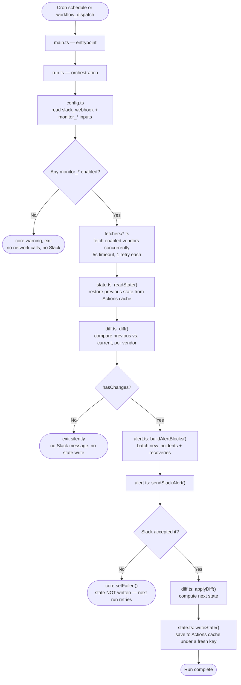
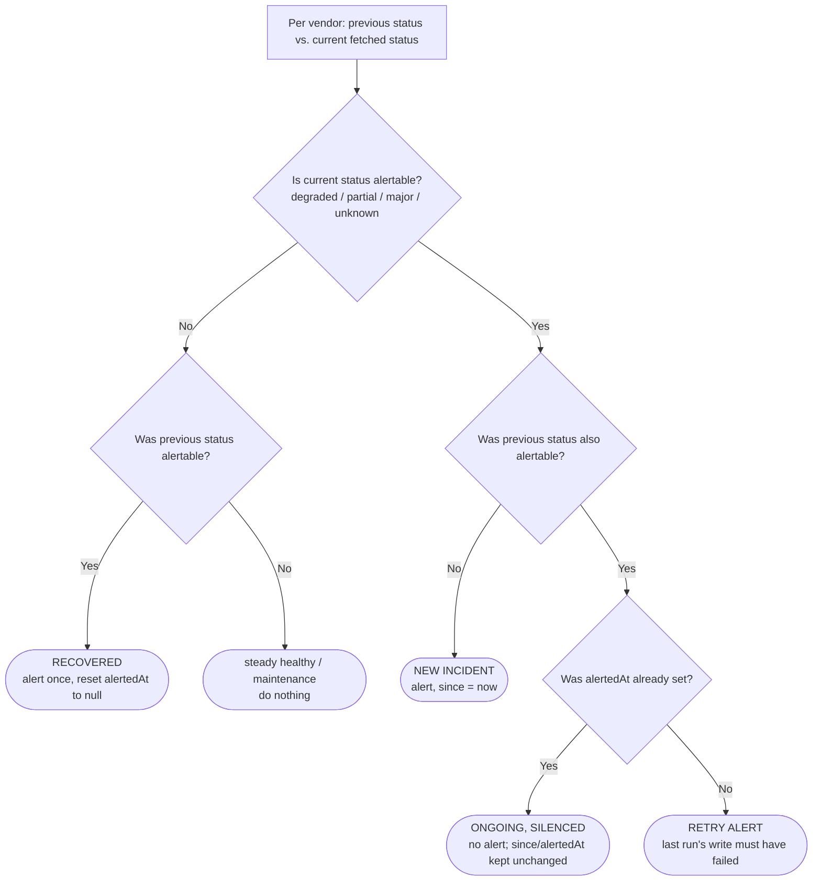

# stackwatch

A GitHub Action that watches the public status pages of the third-party
developer tools your team depends on, and posts a Slack alert the moment one
degrades, recovers, or becomes unreachable. Silent when everything is
healthy; fires once per incident, not once per run.

See [`PRD.md`](./PRD.md) for the full product requirements.

## MVP vendor support

This release supports 4 commonly-used vendors:

| Vendor      | Status page              |
| ----------- | ------------------------- |
| GitHub      | githubstatus.com          |
| Datadog     | status.datadoghq.com      |
| ClickHouse Cloud | status.clickhouse.com |
| Claude / Anthropic | status.claude.com  |

More vendors (Slack, AWS, Vercel, PagerDuty, Linear, ...) can be added later
without restructuring — see [Adding a vendor](#adding-a-vendor).

## Usage

```yaml
name: stackwatch
on:
  schedule:
    - cron: '*/5 * * * *'
  workflow_dispatch:

concurrency:
  group: stackwatch
  cancel-in-progress: false

jobs:
  check:
    runs-on: ubuntu-latest
    steps:
      - uses: yourusername/stackwatch@v1
        with:
          slack_webhook: ${{ secrets.STACKWATCH_SLACK_WEBHOOK }}
          monitor_github: true
          monitor_datadog: true
          monitor_clickhouse: true
          monitor_claude: true
```

### Setup

1. Create a [Slack incoming webhook](https://api.slack.com/messaging/webhooks)
   for the channel you want alerts in, and save it as a repository secret
   named `STACKWATCH_SLACK_WEBHOOK`.
2. Add the workflow above to `.github/workflows/stackwatch.yml`. The
   `concurrency:` block matters more than it looks — without it, an
   unusually slow run (e.g. a vendor API hanging near its 5s timeout) could
   still be in flight when the next 5-minute cron fires, and both runs would
   read the same previous state and could independently alert on the same
   transition. `concurrency:` makes GitHub queue the next run instead of
   starting it in parallel.
3. Enable whichever `monitor_*` inputs you want — every vendor defaults to
   `false` (opt-in only).

That's it — no `permissions:` block, no GitHub token, no PAT. State (which
services were already alerted on) is stored entirely in GitHub Actions
cache, which every workflow gets for free. An earlier version of this
action tried to use a repo variable for that instead, authenticated with
the workflow's own `GITHUB_TOKEN` — but GitHub deliberately blocks the
automatic per-run token from managing Actions variables/secrets via the
REST API (confirmed via real testing: a `403` even with `actions: write`
granted, to stop a workflow from self-escalating by rewriting its own
secrets). Making that work would have required every consumer to create
and maintain a personal access token just for this — real friction for
little benefit, since the cache-only design is confirmed reliable
end-to-end (including correctly suppressing repeat alerts across runs).
The one tradeoff: Actions cache entries are subject to the platform's
normal 7-day-unused eviction, which in practice a 5-minute cron never hits.

Inputs you don't set stay disabled and are never fetched.

### Inputs

| Name                 | Type    | Required | Default | Description                     |
| -------------------- | ------- | -------- | ------- | -------------------------------- |
| `slack_webhook`      | string  | Yes      | —       | Slack incoming webhook URL       |
| `monitor_github`     | boolean | No       | `false` | Monitor GitHub status            |
| `monitor_datadog`    | boolean | No       | `false` | Monitor Datadog status           |
| `monitor_clickhouse` | boolean | No       | `false` | Monitor ClickHouse Cloud status  |
| `monitor_claude`     | boolean | No       | `false` | Monitor Claude / Anthropic status|

### Outputs

Every run (other than "no `monitor_*` enabled") sets these, so a later step
in the same job can react without re-parsing logs:

| Name                  | Type    | Description                                             |
| --------------------- | ------- | --------------------------------------------------------|
| `has_incidents`       | boolean | `true` if any vendor is in a new alertable incident this run |
| `new_incident_count`  | number  | Count of new incidents alerted on this run               |
| `recovered_count`     | number  | Count of vendors that recovered this run                 |
| `alert_sent`          | boolean | `true` if a Slack message was sent and accepted this run  |

Every run also writes a per-vendor status table to the job's **Summary**
tab in the Actions UI — current status plus whether this run alerted or
recovered on it — so you can see the outcome at a glance without opening
logs, even on a totally silent, healthy run.

## How it works

Each run walks through one module per step — the labels below are the actual
source files, in call order:



The trickiest part is the middle box — `diff.ts` classifies *each vendor
independently* by comparing its restored previous status against its
freshly-fetched current status:



That `ONGOING, SILENCED` branch is why a vendor that's still down doesn't
re-alert every 5 minutes — and why `since` keeps pointing at when the
incident *actually* started even across many silent runs, so the eventual
recovery message reports the true total downtime.

## Adding a vendor

1. If the vendor runs on Atlassian Statuspage (`/api/v2/summary.json`), add
   one line to `src/fetchers/index.ts` calling
   `createStatuspageFetcher(name, url)`. Otherwise write a dedicated adapter
   under `src/fetchers/` following `clickhouse.ts` as a template.
2. Register the vendor in `VendorId` (`src/types.ts`), `VENDOR_INPUTS`
   (`src/config.ts`), and as a new `monitor_*` input in `action.yml`.
3. Run `npm run package` to rebuild `dist/index.js`.

## Roadmap: self-hosted Docker daemon (planned)

The GitHub Action above is ideal for a single team already using GitHub
Actions. A separate, self-hosted Docker image is planned for teams that want
one central place to run stackwatch, outside of GitHub Actions billing
entirely.

- **Long-running daemon**, not a run-to-completion script — schedules itself
  internally with `node-cron` so it works identically via `docker run -d`,
  `docker-compose`, an ECS Service, or a k8s Deployment, without depending on
  an external scheduler the way a k8s `CronJob` would.
- **Phase 1**: single-tenant, functionally equivalent to the Action today —
  one webhook, one vendor list — just packaged as a daemon.
- **Phase 2**: multi-subscriber — one running instance polls each distinct
  vendor once and fans out to every subscriber who wants it, so a platform
  team serving many internal teams/channels doesn't need one redundant
  deployment per team, each independently polling the same vendors.
- The vendor-polling, diffing, and Slack-formatting logic (`fetchers/`,
  `diff.ts`, the Block Kit builder in `alert.ts`) is shared with the Action
  unchanged — only the logging/output layer (currently `@actions/core`-
  specific) and the state-storage backend (Actions cache vs. a local
  file/volume) differ between the two.

### Best practice: handling the Slack webhook as a real secret

Unlike the Action (where GitHub Actions secrets already handle this), a
self-hosted container needs to be deliberate about not leaking the webhook:

- `docker inspect` and `kubectl describe pod` both dump plain env vars in
  full — a literal `-e SLACK_WEBHOOK=...` is visible to anyone who can read
  the container/pod, and is one accidental `git add` away from being
  committed if it ends up hardcoded in a compose file or manifest.
- The daemon supports the same convention several official images use (e.g.
  Postgres's `POSTGRES_PASSWORD_FILE`): for any secret input, set
  `<NAME>_FILE` to a file path instead of the literal `<NAME>` env var, and
  the value is read from that file at startup. This composes with:
  - **Kubernetes**: mount a `Secret` (never a `ConfigMap` — only `Secret`
    gets base64-masking and optional at-rest encryption) as a volume, and
    point `SLACK_WEBHOOK_FILE` at the mounted path. The plaintext then only
    ever lives in the `Secret` object and a tmpfs-backed mount — never in
    `kubectl describe pod` output.
  - **Docker Swarm secrets**, which mount at `/run/secrets/<name>` for
    exactly this reason.
  - **Vault Agent injector** and similar sidecars, which write secrets to a
    shared volume as files.
  - Plain `docker run -e SLACK_WEBHOOK=...` still works unchanged for a
    laptop/dev/single-user deployment — no extra ceremony for the simple
    case.
- The webhook is never logged, in any code path, matching the Action's
  existing NFR-4 discipline.

## Development

```bash
npm install
npm run typecheck
npm test           # vitest — unit tests for every module, mocking network/@actions/cache
npm run build      # produces dist/index.js via @vercel/ncc
npm run package    # typecheck + test + build, in that order
```

Tests are colocated as `src/**/*.test.ts` and never bundled into `dist/index.js`
(`ncc` only follows `main.ts`'s own runtime imports). `dist/index.js` is
committed and rebuilt automatically by `.github/workflows/release.yml` on
every push to `main`; don't hand-edit it.
